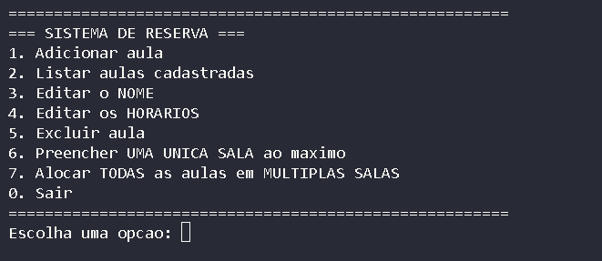
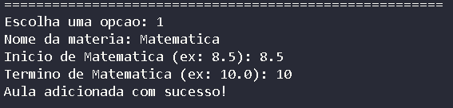
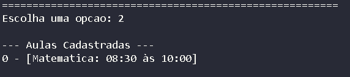
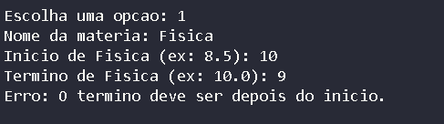
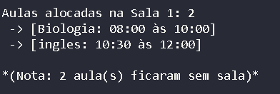
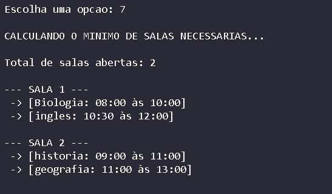

# G29_Greddy_PA-26.1

Número da lista: 29

Conteúdo da disciplina: *Interval Scheduling* e *Interval Partitioning*

## Alunos 
| Nome | Matrícula |
|------|-----------|
| Alan Farias Braga | 251005909 |
| Vilmar José Fagundes | 231026590 |

## Sobre

Esse projeto implementa um Sistema de Agendamento e Alocação de Salas baseado em Algoritmos Gulosos (Greedy Algorithms).

A solução do sistema está nas suas funções de geração de cronograma, para resolver dois problemas clássicos de alocação de recursos. Na simulação de uma sala única, o sistema resolve por meio do algorítmo **Interval Scheduling**. O algoritmo garante rigorosamente a maximização do uso do espaço ordenando os pedidos pelo horário de término, escolhendo sempre a próxima atividade compatível que acaba mais cedo, a sala é liberada o mais rápido possível para a próxima demanda.

Já para o desafio de alocar todas as aulas sem rejeições, o sistema resolve por **Interval Partitioning**, em conjunto com uma **Min-Heap**. Nesse contexto, as aulas são ordenadas de forma estritamente cronológica, pelo horário de início. O algoritmo utiliza a Heap para rastrear e ordenar a disponibilidade das salas abertas, garantindo que o espaço físico que ficará vazio mais cedo permaneça sempre no topo da fila, pronto para ser reaproveitado de forma instantânea.

Conforme o sistema processa a lista de aulas, ele compara o início da atividade com o topo da Heap. Se a sala que libera mais rápido já estiver vazia, a aula é alocada e a sala retorna para a Heap atualizada com o seu novo horário de término. Porém, se a aula precisa começar antes dessa sala esvaziar, o algoritmo conclui que todas as outras também estão ocupadas naquele exato instante, forçando automaticamente a abertura de uma nova sala. Esse ciclo contínuo processa todas as pendências em uma única percursão, garantindo a integridade dos horários e entregando a configuração exata do menor número absoluto de salas necessárias para o funcionamento do projeto.

## Screenshot

A imagem a seguir representa o menu inicial exibido no terminal, o qual pode selecionar qual opção deseja executar

**Imagem 1: Tela inicial**

Foram executados testes manuais com o sistema. A seguir, são apresentadas as capturas de tela relacionadas à execução dos testes 

### Teste 1: Adicionar uma aula com dados válidos

**Passos:**
1. Escolher opção 1.
2. Digitar Nome: Matemática.
3. Digitar Início: 8.5.
4. Digitar Término: 10.0.

**Resultado Esperado:** O sistema exibe "Aula adicionada com sucesso!". Ao acessar a opção 2, deve listar [0 - [Matemática: 08:30 às 10:00]].

Imagem 2: Adição da aula

Imagem 3: Lista das aulas cadastradas 

### Teste 2: Impedir cadastro com término anterior ou igual ao início

**Passos:**
1. Escolher opção 1.
2. Digitar Nome: Física.
3. Digitar Início: 10.0.
4. Digitar Término: 9.0.

**Resultado Esperado**: O sistema exibe o erro "Erro: O termino deve ser depois do inicio." e não cadastra a aula (verificável pela opção 2).

Imagem 4: Adição da aula

### Teste 3: Preencher UMA ÚNICA SALA ao máximo (Opção 6)

**Passos:**
1. Cadastrar as seguinter aulas:
    - Biologia (Início: 8.0, Fim: 10.0)
    - História (Início: 9.0, Fim: 11.0)
    - Inglês (Início: 10.5, Fim: 12.0)
    - Geografia (Início: 11.0, Fim: 13.0)
2. Escolher opção 6 no menu principal.

**Resultado Esperado:**O algoritmo deve escolher: Biologia (termina 10:00), depois Inglês (começa 10:30 e termina 12:00).

Imagem 5: Quantidade máxima de aulas alocadas em uma sala *(Interval Scheduling)*

### Teste 4: Alocar TODAS as aulas em MÚLTIPLAS SALAS

**Passos:**
1. Cadastrar as seguinter aulas:
    - Biologia (Início: 8.0, Fim: 10.0)
    - História (Início: 9.0, Fim: 11.0)
    - Inglês (Início: 10.5, Fim: 12.0)
    - Geografia (Início: 11.0, Fim: 13.0)
2. Escolher opção 7 no menu principal.

**Resultado Esperado:** Deve gerar 2 salas alocando todas as 4 matérias sem deixar nenhuma de fora.

Imagem 6: Quantidade de salas necessárias *(Interval Partitioning)*

### Teste 5: Otimização com lista vazia

**Passos:**
1. Escolher opções 6 ou 7

**Resultado Esperado:** O sistema deve exibir "Nenhuma aula cadastrada." em ambas as opções, sem estourar erros no console.

Imagem 7: Alerta de "Nenhuma aula cadastrada"

## Instalação 
Linguagem: Python

## Gravação
A gravação pode ser acessada através do link 
